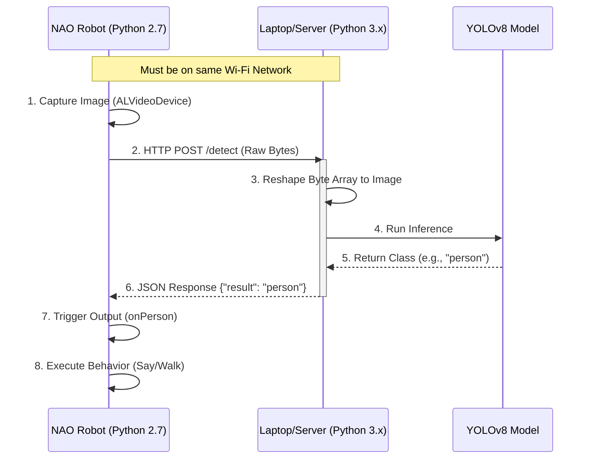
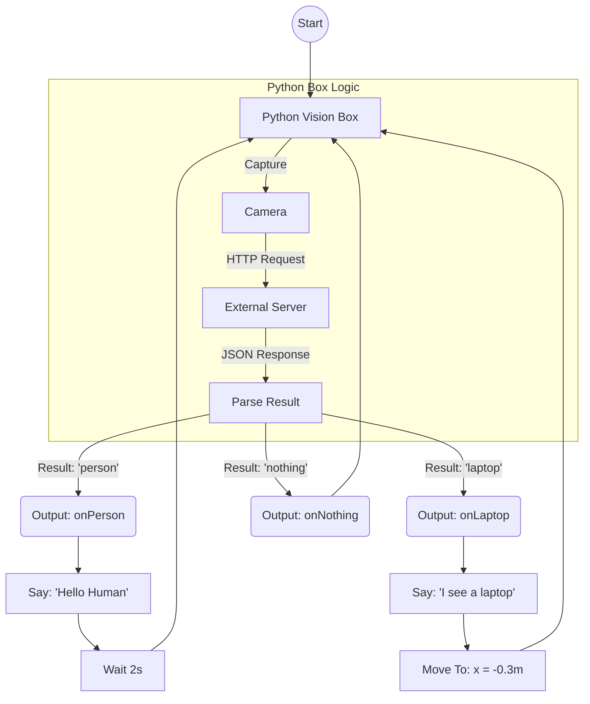

# NAO Robot External Vision System (Brain-Off-Board)

## 1. Project Overview

This project implements a **Brain-Off-Board** architecture for the NAO Robot. Because the NAO's internal processor (Atom Z530 on V4/V5) is insufficient for running modern Deep Learning models, this system offloads image processing to an external server (a high-performance laptop or cloud instance)

**Key Features:**

* **Capture:** NAO captures images using `ALVideoDevice`
* **Offloading:** Images are sent via HTTP POST (raw binary) to a local Flask server
* **Inference:** The server runs **YOLOv8** to detect objects (e.g., Person, Laptop, Chair)
* **Reaction:** NAO receives the classification and executes Choregraphe behaviors (Speech + Locomotion)

---

## 2. System Architecture

The system consists of two distinct environments communicating over a local Wi-Fi network



---

## 3. Prerequisites

### Hardware

* **NAO Robot:** Connected to Wi-Fi
* **Host Machine:** Laptop/PC running the server (must be on the same Wi-Fi as NAO)

### Software

* **Robot Side:** Choregraphe Suite (for behavior programming)
* **Server Side:** Python 3.8+ installed

---

## 4. Installation & Setup

### A. Server Side (The Brain)

The server receives images and runs the AI

1. **Install Dependencies:**
```bash
pip install flask ultralytics numpy

```


2. **Run the Server:**
Save the server code as `nao_server.py` and run it:
```bash
python nao_server.py

```


*Note: Ensure the terminal says `Running on http://0.0.0.0:5000`*

### B. Robot Side (The Eyes)

The robot script acts as the client

1. Open **Choregraphe**
2. Create a **Python Script Box**
3. Add the Client Code (provided in previous steps)
4. **CRITICAL:** Edit the IP address line in the script to match your laptop's IP:
```python
self.server_url = "http://192.168.X.X:5000/detect"

```


---

## 5. Choregraphe Logic Flow

The following flowchart illustrates how to wire the boxes in Choregraphe to achieve the logic: *"If Person -> Say Hello. If Laptop -> Walk Away"*



---

## 6. Implementation Guide

### Wiring the Boxes

1. **Vision Box:** Custom Python box containing the client code
2. **Logic Switching:** The outputs of the Vision Box (`onPerson`, `onLaptop`) act as a Switch Case
3. **Behaviors:**
* Link `onPerson`  **Say Text** box ("I see a person")
* Link `onLaptop`  **Say Text** box ("I see a laptop")  **Move To** box (X: -0.3)


4. **Looping:** Connect the end of the behavior boxes back to the `onStart` of the Vision Box to create a continuous detection loop

---

## 7. Troubleshooting

| Issue | Possible Cause | Solution |
| --- | --- | --- |
| **Connection Failed** | Laptop Firewall | Allow Python/Flask through Windows Firewall/UFW on port 5000. |
| **Connection Failed** | Wrong IP | Run `ipconfig` (Windows) or `ifconfig` (Mac/Linux) and update the robot script. |
| **"Nothing" Detected** | Lighting | Ensure the room is well lit. Nao's cameras have poor dynamic range. |
| **Slow Response** | Network Latency | Ensure both devices are on a stable Wi-Fi. Avoid public/university networks with client isolation. |
| **Import Error** | Missing Libs | Ensure `urllib2` is used in Choregraphe (Python 2.7) and `requests` is NOT used. |

---

## 8. Future Improvements

* **State Machine:** Implement a `Wait` state so the robot doesn't spam "I see a person" 5 times per second
* **Object Tracking:** Use the Bounding Box coordinates returned by YOLO to make NAO turn its head toward the object
* **TTS Integration:** Send the exact label name back to NAO so it can say "I see a [detected_object]" dynamically
